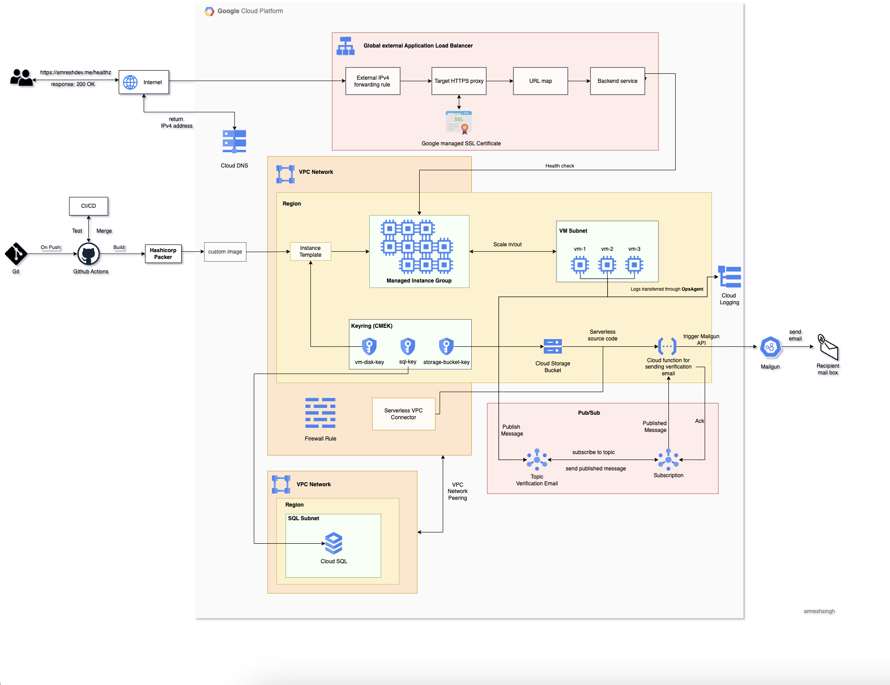

# Setting Up Google Cloud Platform Infrastructure with Terraform

## Infrastructure Architecture



## Introduction

This guide provides comprehensive steps for setting up infrastructure on Google Cloud Platform using Terraform. The architecture diagram above illustrates the components involved in the setup.

## Prerequisites

Before proceeding, ensure you have the following:

- Google Cloud Platform account
- Google Cloud SDK (gcloud CLI) installed
- Terraform CLI installed

## Configuration Steps

1. Install and set up the gcloud CLI and Terraform on your local machine.

2. Clone the repository using:

3. Navigate to the cloned repository:
   ```bash
   cd tf-gcp-infra
   ```

4. **Review and Update Terraform Configuration**:
   - Create or modify a Terraform configuration file (e.g., `main.tf`) to define resources like networks and subnets. Avoid hard-coding values, and use variables for a dynamic configuration.
   - Define variables in a separate file (e.g., `variables.tf`) to store values such as project ID, region, VPC CIDR range, etc. This allows reuse of the Terraform configuration across multiple VPCs.

5. Initialize Terraform:
   ```bash
   terraform init
   ```

6. Validate the configuration:
   ```bash
   terraform validate
   ```

7. Plan infrastructure changes:
   ```bash
   terraform plan
   ```

8. Apply the changes to create VPC and subnets:
   ```bash
   terraform apply
   ```

### Checking State

Check the state of your infrastructure using:
```bash
terraform show
```

## Continuous Integration (CI) Workflow

The CI workflow for this project is implemented using GitHub Actions:

1. GitHub Actions triggers the workflow upon pull request or push events.
2. The workflow checks out the repository.
3. Terraform is installed and initialized.
4. The `terraform fmt` command formats the configuration.
5. The `terraform validate` command checks the syntax.
6. If validation succeeds, the workflow proceeds; otherwise, it fails and notifies the user.
7. Additional steps such as planning and applying changes can be included if configured.

## Architecture Overview

This project automates the setup of several key components using Terraform on Google Cloud Platform, ensuring consistent and reproducible infrastructure.

### Managed SSL Certificate

Configured to secure web applications with HTTPS.

### Virtual Private Cloud (VPC)

Custom networks and subnetworks are configured to efficiently manage network resources.

### Cloud SQL Database

A Cloud SQL instance is provisioned to store and manage application data.

### Cloud Functions

Serverless functions are triggered by Pub/Sub events, handling tasks like sending emails.

### Pub/Sub Topics

Facilitates asynchronous communication, enabling a decoupled and scalable architecture.

### Continuous Integration (CI)

Ensures infrastructure changes are validated and applied smoothly.

### Cloud VM Instance

Virtual machines host the application and provide computing resources in the cloud.

### Managed Instance Group

Automatically scales and manages identical VM instances, ensuring high availability and load balancing.

### Load Balancer

Distributes incoming traffic across VM instances to improve scalability and availability.

### Cloud DNS

Handles domain name resolution for easy access to the application, providing reliable DNS hosting.

### Instance Template

Defines configuration settings for VM instances, ensuring consistency in provisioning.

### Key Rings

Manages encryption keys for enhanced data security in centralized storage.

### Cloud Logging with Ops Agent

Collects and analyzes logs from GCP services to monitor performance and security.
